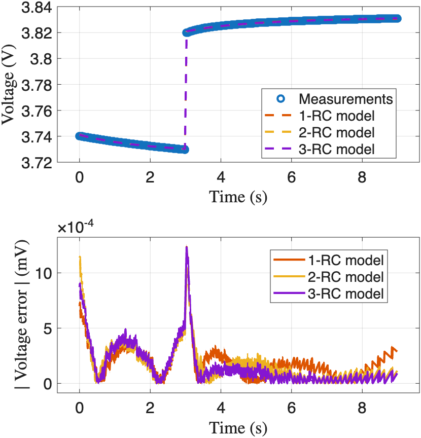

# Battery ECM Parameter Estimation
Parameter estimation of 1RC, 2RC, and 3RC equivalent-circuit models (ECMs) using a **two-stage least squares (two-stage LS)** approach from batch pulse–relaxation measurments.

## Overview
This repository demonstrates how to extract ECM parameters from battery pulse-relaxation experiments:

Stage 1. **(LS-1)** – Estimate RC time constants:  τₙ =  Rₙ Cₙ; n= 1, 2, 3.

Stage 2. **(LS-2)** – With τₙ fixed, solve a linear least squares problem to estimate:  
   - Open-circuit voltage (OCV)  
   - OCV slope to capacity ratio (κ = dOCV/Q); a bias term.
   - Ohmic resistance (R₀)  
   - RC branch resistances (Rₙ, n = 1, 2, 3)
   - Capacitances are then recovered as:  Cₙ = τₙ / Rₙ
   
## File Structure   
```bash
 Battery_ECM_Parameter_Estimation/
│
├── README.md                   
├── LICENSE
├── Demo.m                      # Matlab demo script showing usage on sample data
├── twoStageLS.m                # Matlab function for 1RC/2RC/3RC parameter estimation
├── SamplePulseRelaxationData.mat # Sample pulse-relaxation data
├── SamplePulseRelaxationFit.png # Example plot for pulse-relaxation fit
 ```   
## Usage
Run demo:
```
Battery_ECM_Parameter_Estimation/Demo.m
```
or 

Run function: 
```matlab
[theta_1RC] = twoStageLS(vbatt, ibatt, t, '1RC');
[theta_2RC] = twoStageLS(vbatt, ibatt, t, '2RC');
[theta_3RC] = twoStageLS(vbatt, ibatt, t, '3RC');
```
Note: The inputs (```vbatt```, ```ibatt```, ```t```) should come from a pulse–relaxation experiment, i.e., a discharge (or charge) pulse followed by a rest period.

<p align="center">
  
</p>

## Reference
**Two-Stage Least Squares for Equivalent-Circuit Model Parameter Estimation of Li-Ion Batteries Using Pulse-Relaxation Excitation**

- **Journal (IEEE Transactions on Instrumentation and Measurement):** https://ieeexplore.ieee.org/document/11301817  
- **Preprint:** https://www.techrxiv.org/users/860676/articles/1361821-two-stage-least-squares-for-equivalent-circuit-model-parameter-estimation-of-li-ion-batteries-using-pulse-relaxation-excitation 

